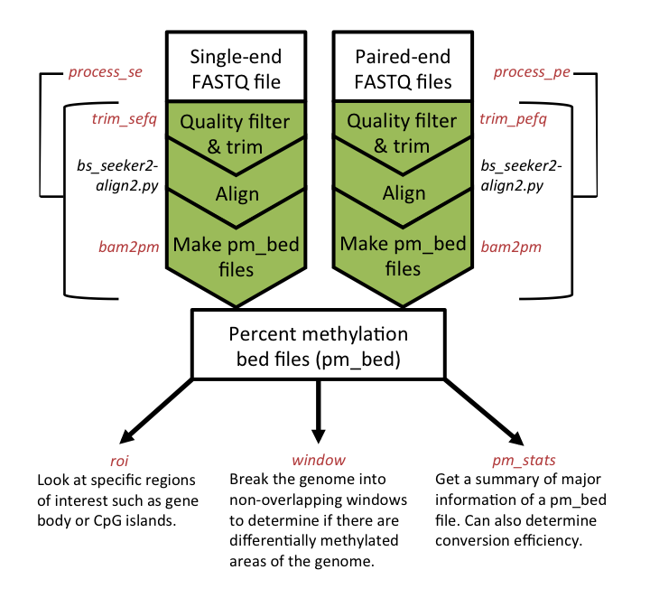

# WGBS_Tools Examples

This will go through an example WGBS single-end sequenced experiment. WGBS_Tools can also analyze paired end experiments using slightly different commands. For instance, you would use *process_pe* for paired end experiments and *process_se* for single end experiments.

Here is a basic workflow:




## Load genomic information

Before processing your sample data, you first need to ensure you have the genomic specific information accessible. That means:

1. Download the FASTA file of your genome. This can be done through the [UCSC downloads](http://hgdownload.cse.ucsc.edu/downloads.html) page. Just select
the genome you are using then click on "Full data set". Now scroll to the bottom of the page and there should be a file named *genomename*.fa.gz. For example,
the Dolphin genome's fasta file is named *turTru2.fa.gz*.

1. Create a BS-Seeker2 index from the fasta file. Instructions for this can be found at [BS-Seeker2](https://github.com/BSSeeker/BSseeker2) 
under the *bs_seeker2-build.py* section.

You then need to add the genome specific information to you *info.yaml* file. You can do this one of two ways:

1. Add your genome to the *info.yaml* file by using the following command:

```
wgbs_tools 
```
